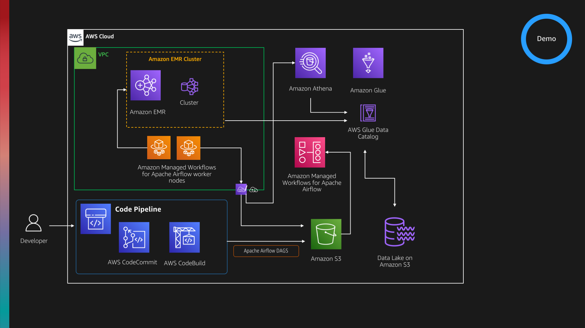
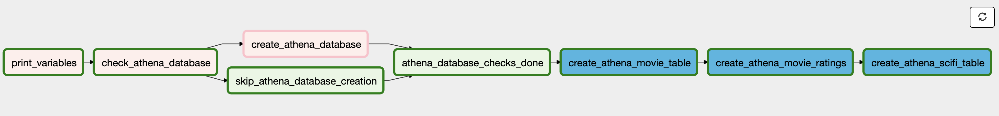
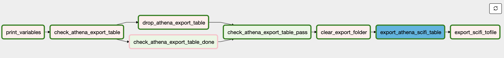

## DevDay Data

This project repository provides resources that I have used to demonstrate how you can automate tasks as part of your Extract, Load and Transform (ELT) work you are doing.

**Costs**

Running this demo will generate costs on your AWS bill so please be aware of that. Costs will vary, but when I was running this during the development, the costs were approx. $50 - $65  per day whilst I was putting these demos together. Make sure you remove/delele all the resources when you are done.

### Demos

There are a couple of demos which look to solve a couple of use cases/business problems you might have. The scenario is that you have data in your data lake (in this demo, I am using Amazon S3 as my datalake). 

The data in this demo setup are files relating to films, and we have movie titles, movie ratings, movie tags and some other information. These are already clean and being used by other parts of our imaginary business. The data is in csv format, and has thousands of records. In a real world situation you would have optimised data formats and larger volumes of data, but the demos should illustrate how you can approach this even with bigger data volumes.

You can download the data [here](http://files.grouplens.org/datasets/movielens/ml-latest-small.zip). This is the small dataset but you can also try this with the larger ones - it should work equally well.

You have been asked to do the following:

* create some new tables from data in your data lake to specifically target a genre of films (in our example, we are going to use SciFi and Comedy) as the business is exploring new opportunities and need some insights into these kinds of films. The data is going to be used by the data visualisation and reporting team to create some dashboards and graphs from the data we provide.
* the data scientist team are creating a new machine learning model and need some new data they can do some feature engineering with, so they have asked us to create some new files in the data lake they can use

The persona that has been asked to do this will have database expertise, with a good understanding of SQL and looking to leverage that as part of the solution.

**Demo One - Amazon Athena**

Amazon Athena is an interactive query service that makes it easy to analyze data in Amazon S3 using standard SQL.Amazon Athena uses Presto with ANSI SQL support and works with a variety of standard data formats, including CSV, JSON, ORC, Avro, and Parquet.

In this demo, we will automate the running of Amazon Athena queries to solve both the problems we have been asked. You should be able to apply the elements of these demos to your own use cases.

**Demo Two - Amazon EMR**

Amazon EMR is a big data platform for processing vast amounts of data using open source tools such as Apache Spark, Apache Hive, Apache HBase, Apache Flink, Apache Hudi, and Presto.

In this demo, we will automate the running of Apache Hive and Presto to solve both the problems we have been asked. You should be able to apply the elements of these demos to your own use cases.



#### Setup of environment

For this setup, I used one of my previous blog posts to setup an instance of Managed Workflows for Apache Airflow (MWAA) as well as a simple CI/CD setup. You can see that setup [here](https://dev.to/aws/automating-the-installation-of-managed-workflows-for-apache-airflow-5h8a) and the CI/CD setup [here](https://dev.to/aws/a-simple-ci-cd-system-for-your-development-workflow-30b4). With this setup, I could develop/work on the workflows using my preferred local IDE (I used Visual Studio Code), commit code to soure control and then the revised DAG would appear in the Apache Airflow UI is around 20-30 seconds.

From a permissions perspective I did have to make a couple of changes:

* I needed to increase the scope of the permissions that the MWAA execution role had within the Amazon S3 buckets. I do not provide a blanket access, so needed to add a few more resources. If you get any Access Denied errors, then make sure you have the right permissions
* I needed to add new permissions to allow the MWAA worker nodes to kick off and then terminate jobs on Amazon EMR.
* I needed to add new permissions to allow the MWAA worker nodes to access Amazon Athena
* As I am using AWS Secrets Managers to hold variables, I needed to allow the MWAA worker nodes permissions, so using the standard SecretsManagerReadWrite policy

I figured these out as I went along and my workflows stopped working, and learned a lot about how to scope down the permissions to the least possible.

Part of the setting up of the MWAA environment sets up the VPC, so I used this VPC to deploy my Amazon EMR cluster. I needed to open ssh access to my IP so I could connect to the head node to run various presto-cli commands, as well as setting up the ssh tunnel that FoxyProxy uses to connect. On that note, I have put in one of the folders the configuration file I used that allows me to use that ssh tunnel and FoxyProxy - it is documented on the Amazon EMR pages, but you can use this one too.

I then setup and left running for the duration of the demo, one Amazon EMR cluster so I could connect and check everything was as it should be. For the purposes of the demo, it is probably quickest to set this up via the gui as it will take you around 2-3 minutes.

#### Demo One

The first demo uses Amazon Athena, and these are the manual steps that the workflow needs to automate. Here the {s3location} is where you have created your data lake using the movielens data above.

Create database using the following query:

```create database scifimovies```

Then import the data

```
CREATE EXTERNAL TABLE IF NOT EXISTS scifimovies.movies (
  `movieID` int,
  `title` string,
  `genre` string 
)
ROW FORMAT SERDE 'org.apache.hadoop.hive.serde2.lazy.LazySimpleSerDe'
WITH SERDEPROPERTIES (
  'serialization.format' = ',',
  'field.delim' = ','
) LOCATION 's3://{s3location}/movielens/movies/'
TBLPROPERTIES ('has_encrypted_data'='false');
```
and

```
CREATE EXTERNAL TABLE IF NOT EXISTS scifimovies.ratings (
  `userId` int,
  `movieId` int,
  `rating` int,
  `timestamp` bigint 
)
ROW FORMAT SERDE 'org.apache.hadoop.hive.serde2.lazy.LazySimpleSerDe'
WITH SERDEPROPERTIES (
  'serialization.format' = ',',
  'field.delim' = ','
) LOCATION 's3://{s3location}/movielens/ratings/'
TBLPROPERTIES (
  'has_encrypted_data'='false',
  'skip.header.line.count'='1'
); 
```

We can now view ALL the films, and search for the ones we are interested in

```
select * from scifimovies.movies WHERE REGEXP_LIKE (genres, 'SciFi')
```

Lets now create a new table

```
CREATE TABLE IF NOT EXISTS scifimovies.scifi AS WITH scifidata AS (
SELECT REPLACE ( m.title , '"' , '' ) as title, r.rating
FROM scifimovies.movies m
INNER JOIN (SELECT rating, movieId FROM scifimovies.ratings) r on m.movieId = r.movieId WHERE REGEXP_LIKE (genres, 'Sci-Fi')
)
SELECT title, replace(substr(trim(title),-5),')','') as year, AVG(rating) as avrating from scifidata GROUP BY title ORDER BY year DESC,  title ASC;

```

If we wanted to export this to a new file to upload into our datalake

```
CREATE TABLE scifimovies.export
    WITH (
          format = 'JSON',
          external_location = 's3://{s3location}/export/'
    ) AS SELECT * FROM scifimovies.scifi
```

Where we now have the file which we can move to the datalake. We would need to now manually rename this and move it to the right place in the datalake.

So lets see how we can now automate this. We define the individual tasks we need to do, and then put them together together with checks we need to make and branching/decisions that we need to consider.





We break down the workflow into two pieces, one to create the database and tables, the other to export them - this represents the two business problems we are looking to solve.

This is the code that we deploy to Apache Airflow that creates this workflow. You will recognise the SQL used as exactly the same as when we did this manually.

```
from airflow import DAG, settings, secrets
from airflow.operators.python_operator import PythonOperator, BranchPythonOperator
from airflow.operators.dummy_operator import DummyOperator
from airflow.contrib.operators.aws_athena_operator import AWSAthenaOperator
from airflow.contrib.secrets.aws_secrets_manager import SecretsManagerBackend
from airflow.contrib.hooks.aws_hook import AwsHook
from airflow.models import Variable
from airflow.utils.trigger_rule import TriggerRule
from airflow.utils.dates import days_ago
import os
import sys
import boto3
import time

default_args = {
    'owner': 'airflow',
    'depends_on_past': False,
    'email': ['airflow@example.com'],
    'email_on_failure': False,
    'email_on_retry': False,
}

DAG_ID = os.path.basename(__file__).replace('.py', '')

dag = DAG(
    dag_id=DAG_ID,
    default_args=default_args,
    description='DevDay Athena Create SciFi DAG',
    schedule_interval=None,
    start_date=days_ago(2),
    tags=['devday','demo'],
)

# Set Variables used in tasks and stored in AWS Secrets Manager

s3_dlake = Variable.get("s3_dlake", default_var="undefined")
s3_data = Variable.get("s3_data", default_var="undefined")
athena_db = Variable.get("athena_db", default_var="undefined")
athena_output = Variable.get("athena_output", default_var="undefined")

# Define the SQL we want to run to create the tables for our new venture

create_athena_movie_table_query="""
CREATE EXTERNAL TABLE IF NOT EXISTS {database}.movies (
  `movieId` int,
  `title` string,
  `genres` string 
)
ROW FORMAT SERDE 'org.apache.hadoop.hive.serde2.lazy.LazySimpleSerDe'
WITH SERDEPROPERTIES (
  'serialization.format' = ',',
  'field.delim' = ','
) LOCATION 's3://{s3_dlake}/movielens/movies/'
TBLPROPERTIES (
  'has_encrypted_data'='false',
  'skip.header.line.count'='1'
); 
""".format(database=athena_db, s3_dlake=s3_dlake)

create_athena_ratings_table_query="""
CREATE EXTERNAL TABLE IF NOT EXISTS {database}.ratings (
  `userId` int,
  `movieId` int,
  `rating` int,
  `timestamp` bigint 
)
ROW FORMAT SERDE 'org.apache.hadoop.hive.serde2.lazy.LazySimpleSerDe'
WITH SERDEPROPERTIES (
  'serialization.format' = ',',
  'field.delim' = ','
) LOCATION 's3://{s3_dlake}/movielens/ratings/'
TBLPROPERTIES (
  'has_encrypted_data'='false',
  'skip.header.line.count'='1'
); 
""".format(database=athena_db, s3_dlake=s3_dlake)

create_athena_scifi_table_query = """
CREATE TABLE IF NOT EXISTS {database}.scifi AS WITH scifidata AS (
SELECT REPLACE ( m.title , '"' , '' ) as title, r.rating
FROM {database}.movies m
INNER JOIN (SELECT rating, movieId FROM {database}.ratings) r on m.movieId = r.movieId WHERE REGEXP_LIKE (genres, 'Sci-Fi')
)
SELECT title, replace(substr(trim(title),-5),')','') as year, AVG(rating) as avrating from scifidata GROUP BY title ORDER BY year DESC,  title ASC;
""".format(database=athena_db)

def py_display_variables(**kwargs):
    print("Data Lake location " + s3_dlake + " ")
    print("Data within Lake " + s3_data + " ")
    print("New Athena DB " + athena_db + " ")
    print("Output CSV file we create " + athena_output + " ")

disp_variables = PythonOperator (
	task_id='print_variables',
	provide_context=True,
	python_callable=py_display_variables,
	dag=dag
	)

# Supporting functions that are called by DAGs
def check_athena_database(**kwargs):
    ath = boto3.client('athena')
    try:
        response = ath.get_database(
            CatalogName='AwsDataCatalog',
            DatabaseName=athena_db
        )
        print("Database already exists - skip creation")
        return "skip_athena_database_creation"
        #return "check_athena_export_table_done"
    except:
        print("No Database Found")
        return "create_athena_database"

def create_db(**kwargs):
    print("Creating the database if it doesnt exist")
    ath = boto3.client('athena')
    ath.start_query_execution(
        QueryString='CREATE DATABASE IF NOT EXISTS '+ athena_db,
        ResultConfiguration={'OutputLocation': 's3://{s3_dlake}/queries/'.format(s3_dlake=s3_dlake)},
        WorkGroup="devday-demo"
        )
# Dag logic goes here

check_athena_database = BranchPythonOperator(
    task_id='check_athena_database',
    provide_context=True,
    python_callable=check_athena_database,
    retries=1,
    dag=dag,
)

skip_athena_database_creation = DummyOperator(
    task_id="skip_athena_database_creation",
    trigger_rule=TriggerRule.NONE_FAILED,
    dag=dag,
)

create_athena_database = PythonOperator (
    task_id='create_athena_database',
	provide_context=True,
	python_callable=create_db,
	dag=dag
    )

athena_database_checks_done = DummyOperator(
    task_id="athena_database_checks_done",
    trigger_rule=TriggerRule.NONE_FAILED,
    dag=dag,
)

create_athena_movie_table = AWSAthenaOperator(
    task_id="create_athena_movie_table",
    query=create_athena_movie_table_query, 
    workgroup = "devday-demo", 
    database=athena_db,
    output_location='s3://'+s3_dlake+"/"+athena_output+'create_athena_movie_table'
    )
create_athena_ratings_table = AWSAthenaOperator(
    task_id="create_athena_movie_ratings",
    query=create_athena_ratings_table_query, 
    workgroup = "devday-demo", 
    database=athena_db,
    output_location='s3://'+s3_dlake+"/"+athena_output+'create_athena_ratings_table'
    )
create_athena_scifi_table = AWSAthenaOperator(
    task_id="create_athena_scifi_table",
    query=create_athena_scifi_table_query, 
    workgroup = "devday-demo", 
    database=athena_db,
    output_location='s3://'+s3_dlake+"/"+athena_output+'create_athena_scifi_table'
    )


disp_variables >> check_athena_database

check_athena_database >> skip_athena_database_creation >> athena_database_checks_done >> create_athena_movie_table >> create_athena_ratings_table >> create_athena_scifi_table  

check_athena_database >> create_athena_database >> athena_database_checks_done >> create_athena_movie_table >> create_athena_ratings_table >> create_athena_scifi_table  
```

And this is the workflow code that does the export. Notice in this one, we have used a different approach on how we connect the tasks in the workflow, demonstrating how you can use the .set_upstream and .set_downstream as well as what we used in the previous workflow, the >>.

```
from airflow import DAG, settings, secrets
from airflow.operators.python_operator import PythonOperator, BranchPythonOperator
from airflow.operators.dummy_operator import DummyOperator
from airflow.operators import HttpSensor, S3KeySensor
from airflow.contrib.operators.aws_athena_operator import AWSAthenaOperator
from airflow.contrib.secrets.aws_secrets_manager import SecretsManagerBackend
from airflow.contrib.hooks.aws_hook import AwsHook
from airflow.models import Variable
from airflow.utils.trigger_rule import TriggerRule
from airflow.utils.dates import days_ago
import os
import sys
import boto3
import time

default_args = {
    'owner': 'airflow',
    'depends_on_past': False,
    'email': ['airflow@example.com'],
    'email_on_failure': False,
    'email_on_retry': False,
}

DAG_ID = os.path.basename(__file__).replace('.py', '')

dag = DAG(
    dag_id=DAG_ID,
    default_args=default_args,
    description='DevDay Athena export SciFi DAG',
    schedule_interval=None,
    start_date=days_ago(2),
    tags=['devday','demo'],
)

# Set Variables used in tasks and stored in AWS Secrets Manager

s3_dlake = Variable.get("s3_dlake", default_var="undefined")
s3_data = Variable.get("s3_data", default_var="undefined")
athena_db = Variable.get("athena_db", default_var="undefined")
athena_output = Variable.get("athena_output", default_var="undefined")

# Define the SQL we want to run to create the tables for our new venture
# This will export the table scifi to a gzip JSON file in the external_location

export_athena_scifi_table_query = """
CREATE TABLE {database}.export
    WITH (
          format = 'JSON',
          external_location = 's3://{datalake}/export/'
    ) AS SELECT * FROM {database}.scifi
""".format(database=athena_db, datalake=s3_dlake)

export_athena_scifi_table_query2 = """
CREATE TABLE {database}.export
    WITH (
          format = 'TEXTFILE',
          field_delimiter = ',',
          external_location = 's3://{datalake}/export/'
    ) AS SELECT * FROM {database}.scifi
""".format(database=athena_db, datalake=s3_dlake)


def py_display_variables(**kwargs):
    print("Data Lake location " + s3_dlake + " ")
    print("Data within Lake " + s3_data + " ")
    print("New Athena DB " + athena_db + " ")
    print("Output CSV file we create " + athena_output + " ")

disp_variables = PythonOperator (
	task_id='print_variables',
	provide_context=True,
	python_callable=py_display_variables,
	dag=dag
	)

# Supporting functions that are called by DAGs
def check_export_table(**kwargs):
    ath = boto3.client('athena')
    try:
        response = ath.get_table_metadata(
            CatalogName='AwsDataCatalog',
            DatabaseName= athena_db,
            TableName='export'
        )
        print("Table already exists - drop table")
        return "drop_athena_export_table"
    except:
        print("No Table Found")
        return "check_athena_export_table_done" 

def drop_athena_export_table(**kwargs):
    print("Dropping export Table")
    ath = boto3.client('athena')
    ath.start_query_execution(
        QueryString='DROP TABLE IF EXISTS export',
        QueryExecutionContext = {
                'Database' : athena_db
            },
        ResultConfiguration={'OutputLocation': 's3://{s3_dlake}/queries/'.format(s3_dlake=s3_dlake)},
        WorkGroup="devday-demo"
        )
def clear_export_folder(**kwargs):
    s3 = boto3.resource('s3')
    bucket = s3.Bucket(s3_dlake)
    try:
        print("Deleting files in exports folder")
        for obj in bucket.objects.filter(Prefix='export/'):
            print(bucket.name,obj.key)
            s3.Object(bucket.name,obj.key).delete()
    except:
        print("Could not delete files for some reason - maybe not there?")

def export_scifi_tofile(**kwargs):
    print("Exporting the file for other users to use")
    ath = boto3.client('athena')
    s3 = boto3.resource('s3')
    try:
        get_query = ath.start_query_execution(
            QueryString ='select "$path" from export LIMIT 1',
            QueryExecutionContext = {
                'Database' : athena_db
            },
            ResultConfiguration = {
                'OutputLocation': 's3://'+s3_dlake+'/queries/'},
            WorkGroup="devday-demo"
        )
        get_query_exe_id = ath.get_query_execution(
            QueryExecutionId = get_query['QueryExecutionId']
            )

        time.sleep(5)
        result = ath.get_query_results(
            QueryExecutionId = get_query['QueryExecutionId']
        )
        
        result_data = result['ResultSet']['Rows'][1:]
        file = result_data[0]['Data'][0]['VarCharValue']
        print("Resource to be copied: ", file)
        renamed_file = file.split(s3_dlake +'/export/',1)[1]
        print("File to be copied: ", renamed_file)
        print("Using the following copy statement",s3_dlake + '/export/' + renamed_file )

        copy_source = {'Bucket':s3_dlake, 'Key': 'export/' + renamed_file}
        bucket = s3.Bucket(s3_dlake)
        obj = bucket.Object('movielens/scifi/scifi-movies.csv.gz')
        #obj = bucket.Object('movielens/scifi/scifi-movies.json.gz')
        obj.copy(copy_source)

    except Exception as e:
        print("Could not find path")
        print(e)

# Dag logic goes here

check_athena_export_table = BranchPythonOperator(
    task_id='check_athena_export_table',
    provide_context=True,
    python_callable=check_export_table,
    trigger_rule="all_done",
    dag=dag,
)

check_athena_export_table_done = DummyOperator(
    task_id="check_athena_export_table_done",
    dag=dag,
)
check_athena_export_table_pass = DummyOperator(
    task_id="check_athena_export_table_pass",
    trigger_rule=TriggerRule.ONE_SUCCESS,
    dag=dag,
)

drop_athena_export_table = PythonOperator (
    task_id='drop_athena_export_table',
	provide_context=True,
	python_callable=drop_athena_export_table,
	dag=dag
    )

clear_export_folder = PythonOperator (
    task_id='clear_export_folder',
	provide_context=True,
	python_callable=clear_export_folder,
	dag=dag
    )

export_athena_scifi_table = AWSAthenaOperator(
    task_id="export_athena_scifi_table",
    #query=export_athena_scifi_table_query,
    query=export_athena_scifi_table_query2, 
    workgroup = "devday-demo", 
    database=athena_db,
    sleep_time = 60,
    output_location='s3://'+s3_dlake+"/"+athena_output+'export_athena_scifi_table'
    )


export_scifi_tofile = PythonOperator (
    task_id='export_scifi_tofile',
	provide_context=True,
	python_callable=export_scifi_tofile,
	dag=dag
    )

check_athena_export_table.set_upstream(disp_variables)
drop_athena_export_table.set_upstream(check_athena_export_table)
check_athena_export_table_done.set_upstream(check_athena_export_table)
check_athena_export_table_pass.set_upstream(drop_athena_export_table)
check_athena_export_table_pass.set_upstream(check_athena_export_table_done)
export_athena_scifi_table.set_upstream(clear_export_folder)
clear_export_folder.set_upstream(check_athena_export_table_pass)
export_scifi_tofile.set_upstream(export_athena_scifi_table)
```

#### Demo Two

For the second demo, we repeat the scenarios but this time we prefer to use Hive and Presto via Amazon EMR.

We have an Amazon EMR cluster up and running, which we can connect (via ssh/tunnel and FoxyProxy) our browser to so we can use the Hue GUI editor to run our Hive/Presto SQL.

Selecting Hive, we can do the same as with the previous (Demo One, manual) steps as follows. This time, we are going to create a database called films and look for Comedy films:

```
create database films;
```
Now lets load the data from the datalake

```
CREATE EXTERNAL TABLE films.movies (
    movieId INT,
    title   VARCHAR(100),
    genres  VARCHAR(100)

) ROW FORMAT DELIMITED FIELDS TERMINATED BY ','
  LOCATION 's3://{s3location}/movielens/movies/';
```

```
CREATE EXTERNAL TABLE films.ratings (
    userId INT,
    movieId INT,
    rating INT,
    timestampId TIMESTAMP

) ROW FORMAT DELIMITED FIELDS TERMINATED BY ','
  LOCATION 's3://{s3location}/movielens/ratings-alt/';
```

Lets switch to Presto and run some queries

```
select * from comedyfilms.ratings WHERE REGEXP_LIKE (genres, 'Comedy')
```

Lets now create a new table with the comedy films by year and average rating.

```
WITH comedydata AS (
SELECT REPLACE ( m.title , '"' , '' ) as title, r.rating
FROM films.movies m
INNER JOIN (SELECT rating, movieId FROM films.ratings) r on m.movieId = r.movieId WHERE REGEXP_LIKE (genres, 'Comedy')
  )
SELECT title, replace(substr(trim(title),-5),')','') as year, AVG(rating) as avrating from comedydata GROUP BY title ORDER BY year DESC,  title ASC
```

So far so good, now lets create the export file. We will do this from the presto-cli, and create an output file. You will now need to connect via ssh to the Amazon EMR head node.

Once connected, create a file as follows (called export.sql):

```
CREATE EXTERNAL TABLE films.comedy (
    title   STRING,
    year    INT,
    rating  INT

) ROW FORMAT DELIMITED FIELDS TERMINATED BY '\t'
  LOCATION 's3://{s3location}/movielens/comedy/';
```

To automate this workflow, we are going to use the following approach:

To run in Amazon EMR, we will generate our HIVE and Presto sql scripts and upload to an s3 bucket, and then run these scripts via an Amazon EMR script runner task. This will be automed all by our Airflow DAG. Some things to notice:

* We are generating the information that will be submitted to the Amazon EMR cluster to run - we will create an auto-terminating cluster as we want to optimise the costs of running these jobs
* We define some additional variables we store in AWS Secrets Manager - we are specifically now defining the genre, so whilst this example sets Comedy, we could change that variable and we could create tables/views for any genre the business might need.
* The DAG creates the actual script files themselves and uses variables so we do not need to hard code - there are still some things in the DAG that are hardcoded (like the initial Movielens data, so you could improve this for your own use cases)


Here is the code:

```
from airflow import DAG, settings, secrets
from airflow.operators.python_operator import PythonOperator, BranchPythonOperator
from airflow.operators.dummy_operator import DummyOperator
from airflow.contrib.operators.aws_athena_operator import AWSAthenaOperator
from airflow.contrib.secrets.aws_secrets_manager import SecretsManagerBackend
from airflow.contrib.operators.emr_add_steps_operator import EmrAddStepsOperator
from airflow.contrib.operators.emr_create_job_flow_operator import EmrCreateJobFlowOperator
from airflow.contrib.operators.emr_terminate_job_flow_operator import EmrTerminateJobFlowOperator
from airflow.contrib.sensors.emr_step_sensor import EmrStepSensor
from airflow.contrib.hooks.aws_hook import AwsHook
from airflow.models import Variable
from airflow.utils.trigger_rule import TriggerRule
from airflow.utils.dates import days_ago
import os
import sys
import boto3
import time


default_args = {
    'owner': 'airflow',
    'depends_on_past': False,
    'email': ['airflow@example.com'],
    'email_on_failure': False,
    'email_on_retry': False,
}

DAG_ID = os.path.basename(__file__).replace('.py', '')

dag = DAG(
    dag_id=DAG_ID,
    default_args=default_args,
    description='DevDay EMR create SciFi DAG',
    schedule_interval=None,
    start_date=days_ago(2),
    tags=['devday','demo'],
)

# Set Variables used in tasks and stored in AWS Secrets Manager

s3_dlake = Variable.get("s3_dlake", default_var="undefined")
s3_data = Variable.get("s3_data", default_var="undefined")
emr_db = Variable.get("emr_db", default_var="undefined")
emr_output = Variable.get("emr_output", default_var="undefined")
genre = Variable.get("emr_genre", default_var="undefined")
genre_t = Variable.get("emr_genre_table", default_var="undefined")


def py_display_variables(**kwargs):
    print("Data Lake location " + s3_dlake)
    print("Data within Lake " + s3_data)
    print("EMR DB " + emr_db)
    print("Genre " + genre)
    print("Genre Table to be created " + genre_t)

disp_variables = PythonOperator (
	task_id='print_variables',
	provide_context=True,
	python_callable=py_display_variables,
	dag=dag
	)

## Amazon EMR info

CREATE_DATABASE = [
    {
        'Name': 'Create Genre Database',
        'ActionOnFailure': 'CONTINUE',
        'HadoopJarStep': {
            'Jar': 'command-runner.jar',
            'Args': [
                'hive-script',
                '--run-hive-script',
                '--args',
                '-f',
                's3://{{ var.value.s3_dlake }}/scripts/create-film-db.hql'
            ]
        }
    }
]

CREATE_TABLES = [
    {
        'Name': 'Create Tables',
        'ActionOnFailure': 'CONTINUE',
        'HadoopJarStep': {
            'Jar': 'command-runner.jar',
            'Args': [
                'hive-script',
                '--run-hive-script',
                '--args',
                '-f',
                's3://{{ var.value.s3_dlake }}/scripts/create-film-db-tables.hql'
            ]
        }
    }
]

PRESTO_QUERY = [
    {
        'Name': 'Run Presto to create Genre Tables',
        'ActionOnFailure': 'CONTINUE',
        'HadoopJarStep': {
            'Jar': 'command-runner.jar',
            'Args': [
                'bash',
                '-c',
                'aws s3 cp s3://devday-demo-airflow-sql/scripts/run-presto-query.sh . ; chmod +x run-presto-query.sh ; ./run-presto-query.sh ; echo removing script; rm run-presto-query.sh'
            ]
        }
    }
]

CREATE_GENRE_TABLES = [
    {
        'Name': 'Create Genre Tables',
        'ActionOnFailure': 'CONTINUE',
        'HadoopJarStep': {
            'Jar': 'command-runner.jar',
            'Args': [
                'hive-script',
                '--run-hive-script',
                '--args',
                '-f',
                's3://{{ var.value.s3_dlake }}/scripts/create-genre-film-table.hql'
            ]
        }
    }
]

JOB_FLOW_OVERRIDES = {
    'Name': 'devday-demo-cluster-airflow',
    'ReleaseLabel': 'emr-5.32.0',
    'LogUri': 's3n://{{ var.value.s3_dlake }}/logs',
    'Applications': [
        {
            'Name': 'Spark',
        },
        {
            'Name': 'Pig',
        },
        {
            'Name': 'Hive',
        },
        {
            'Name': 'Presto',
        }
    ],
    'Instances': {
        'InstanceFleets': [
            {
                'Name': 'MASTER',
                'InstanceFleetType': 'MASTER',
                'TargetSpotCapacity': 1,
                'InstanceTypeConfigs': [
                    {
                        'InstanceType': 'm5.xlarge',
                    },
                ]
            },
            {
                'Name': 'CORE',
                'InstanceFleetType': 'CORE',
                'TargetSpotCapacity': 2,
                'InstanceTypeConfigs': [
                    {
                        'InstanceType': 'r5.xlarge',
                    },
                ],
            },
        ],
        'KeepJobFlowAliveWhenNoSteps': True,
        'TerminationProtected': False,
        'Ec2KeyName': 'ec2-rocket',
    },
    'Configurations': [
        {
            'Classification': 'hive-site',
            'Properties': {'hive.metastore.client.factory.class': 'com.amazonaws.glue.catalog.metastore.AWSGlueDataCatalogHiveClientFactory'}
        },
        {
            'Classification': 'presto-connector-hive',
            'Properties': {'hive.metastore.glue.datacatalog.enabled': 'true'}
        },
        {
            'Classification': 'spark-hive-site',
            'Properties': {'hive.metastore.client.factory.class': 'com.amazonaws.glue.catalog.metastore.AWSGlueDataCatalogHiveClientFactory'}
        }
    ],
    'VisibleToAllUsers': True,
    'JobFlowRole': 'EMR_EC2_DefaultRole',
    'ServiceRole': 'EMR_DefaultRole',
    'EbsRootVolumeSize': 32,
    'StepConcurrencyLevel': 1,
    'Tags': [
        {
            'Key': 'Environment',
            'Value': 'Development'
        },
        {
            'Key': 'Name',
            'Value': 'Airflow EMR Demo Project'
        },
        {
            'Key': 'Owner',
            'Value': 'Data Analytics Team'
        }
    ]
}

### Amazon EMR Scripts - create and upload to Amazon S3

HIVE_CREATE_DB = """
create database {database}; 
""".format(database=emr_db)

HIVE_CREATE_DB_TABLES = """
CREATE EXTERNAL TABLE {database}.movies (
    movieId INT,
    title   STRING,
    genres  STRING

) ROW FORMAT DELIMITED FIELDS TERMINATED BY ','
  LOCATION 's3://{datalake}/movielens/movies/';

CREATE EXTERNAL TABLE {database}.ratings (
    userId INT,
    movieId INT,
    rating INT,
    timestampId TIMESTAMP

) ROW FORMAT DELIMITED FIELDS TERMINATED BY ','
  LOCATION 's3://{datalake}/movielens/ratings-alt/';
""".format(database=emr_db,datalake=s3_dlake)

HIVE_CREATE_GENRE_TABLE = """
CREATE EXTERNAL TABLE {database}.{genre_t} (
    title   STRING,
    year    INT,
    rating  INT

) ROW FORMAT DELIMITED FIELDS TERMINATED BY '\t'
  LOCATION 's3://{datalake}/movielens/{genre}/';
""".format(database=emr_db,genre=genre,datalake=s3_dlake,genre_t=genre_t)

PRESTO_SCRIPT_RUN_EXPFILE = """
#!/bin/bash
aws s3 cp s3://{datalake}/scripts/create-genre.sql .
presto-cli --catalog hive -f create-genre.sql --output-format TSV > {genre_t}-films.tsv
aws s3 cp {genre_t}-films.tsv s3://{datalake}/movielens/{genre}/
""".format(database=emr_db,genre=genre,datalake=s3_dlake,genre_t=genre_t)

PRESTO_SQL_GEN_GENRE_CSV = """
WITH {genre}data AS (
SELECT REPLACE ( m.title , '"' , '' ) as title, r.rating
FROM {database}.movies m
INNER JOIN (SELECT rating, movieId FROM {database}.ratings) r on m.movieId = r.movieId WHERE REGEXP_LIKE (genres, '{genre}')
  )
SELECT title, replace(substr(trim(title),-5),')','') as year, AVG(rating) as avrating from {genre}data GROUP BY title ORDER BY year DESC,  title ASC ;
""".format(database=emr_db,genre=genre)


## Supporting Python callables

def py_create_emr_scripts(**kwargs):
    s3 = boto3.resource('s3')
    print("Creating scripts which will be executed by Amazon EMR - will overwrite existing scripts")
    # create create-film-db.hql
    object1 = s3.Object(s3_dlake, 'scripts/create-film-db.hql')
    object1.put(Body=HIVE_CREATE_DB)
    # create create-film-db-tables.hql
    object2 = s3.Object(s3_dlake, 'scripts/create-film-db-tables.hql')
    object2.put(Body=HIVE_CREATE_DB_TABLES)
    # create create-genre-film-table.hql
    object3 = s3.Object(s3_dlake, 'scripts/create-genre-film-table.hql')
    object3.put(Body=HIVE_CREATE_GENRE_TABLE)
    # create create-genre.sql
    object4 = s3.Object(s3_dlake, 'scripts/create-genre.sql')
    object4.put(Body=PRESTO_SQL_GEN_GENRE_CSV)
    # create run-presto-query.sh
    object5 = s3.Object(s3_dlake, 'scripts/run-presto-query.sh')
    object5.put(Body=PRESTO_SCRIPT_RUN_EXPFILE)   

def check_emr_database(**kwargs):
    ath = boto3.client('athena')
    # We use athena as we are using the Glue catalog for the hive metastore
    try:
        response = ath.get_database(
            CatalogName='AwsDataCatalog',
            DatabaseName=emr_db
        )
        print("Database already exists - skip creation")
        return "skip_emr_database_creation"
    except:
        print("No EMR Database Found")
        return "create_emr_database_step"

def check_emr_table(**kwargs):
    ath = boto3.client('athena')
    try:
        response = ath.get_table_metadata(
            CatalogName='AwsDataCatalog',
            DatabaseName= emr_db,
            TableName='movies'
        )
        # we check for movies, but we will be creating comedy
        print("Table exists - create genre")
        return "run_presto_script_step"
    except:
        print("No Table Found - skip, as there are bigger problems!")
        return "check_emr_movie_table_skip" 

## Dags

create_emr_scripts = PythonOperator (
	task_id='create_emr_scripts',
	provide_context=True,
	python_callable=py_create_emr_scripts,
	dag=dag
	)

check_emr_database = BranchPythonOperator(
    task_id='check_emr_database',
    provide_context=True,
    python_callable=check_emr_database,
    retries=1,
    dag=dag,
)

skip_emr_database_creation = DummyOperator(
    task_id="skip_emr_database_creation",
    trigger_rule=TriggerRule.NONE_FAILED,
    dag=dag,
)

create_emr_database_cluster = EmrCreateJobFlowOperator(
    task_id='create_emr_database_cluster', 
    job_flow_overrides=JOB_FLOW_OVERRIDES,
	dag=dag
    )
create_emr_database_step = EmrAddStepsOperator(
    task_id='create_emr_database_step',
    job_flow_id="{{ task_instance.xcom_pull(task_ids='create_emr_database_cluster', key='return_value') }}",
    aws_conn_id='aws_default',
    steps=CREATE_DATABASE,
    )
create_emr_database_sensor = EmrStepSensor(
    task_id='create_emr_database_sensor',
    job_flow_id="{{ task_instance.xcom_pull('create_emr_database_cluster', key='return_value') }}",
    step_id="{{ task_instance.xcom_pull(task_ids='create_emr_database_step', key='return_value')[0] }}",
    aws_conn_id='aws_default',
    )

terminate_emr_cluster = EmrTerminateJobFlowOperator(
    task_id='terminate_emr_cluster',
    job_flow_id="{{ task_instance.xcom_pull('create_emr_database_cluster', key='return_value') }}",
    aws_conn_id='aws_default',
    )

emr_database_checks_done = DummyOperator(
    task_id="emr_database_checks_done",
    trigger_rule=TriggerRule.NONE_FAILED,
    dag=dag,
)

create_emr_tables_step = EmrAddStepsOperator(
    task_id='create_emr_tables_step',
    job_flow_id="{{ task_instance.xcom_pull(task_ids='create_emr_database_cluster', key='return_value') }}",
    aws_conn_id='aws_default',
    steps=CREATE_TABLES,
    )
create_emr_tables_sensor = EmrStepSensor(
    task_id='create_emr_tables_sensor',
    job_flow_id="{{ task_instance.xcom_pull('create_emr_database_cluster', key='return_value') }}",
    step_id="{{ task_instance.xcom_pull(task_ids='create_emr_tables_step', key='return_value')[0] }}",
    aws_conn_id='aws_default',
    )

check_emr_movie_table = BranchPythonOperator(
    task_id='check_emr_movie_table',
    provide_context=True,
    python_callable=check_emr_table,
    trigger_rule="all_done",
    dag=dag,
)

check_emr_movie_table_skip = DummyOperator(
    task_id="check_emr_movie_table_skip",
    dag=dag,
)
check_emr_movie_table_done = DummyOperator(
    task_id="check_emr_movie_table_done",
    trigger_rule=TriggerRule.ONE_SUCCESS,
    dag=dag,
)

run_presto_script_step = EmrAddStepsOperator(
    task_id='run_presto_script_step',
    job_flow_id="{{ task_instance.xcom_pull(task_ids='create_emr_database_cluster', key='return_value') }}",
    aws_conn_id='aws_default',
    steps=PRESTO_QUERY,
    )
run_presto_script_sensor = EmrStepSensor(
    task_id='run_presto_script_sensor',
    job_flow_id="{{ task_instance.xcom_pull('create_emr_database_cluster', key='return_value') }}",
    step_id="{{ task_instance.xcom_pull(task_ids='run_presto_script_step', key='return_value')[0] }}",
    aws_conn_id='aws_default',
    )

create_genre_table_step = EmrAddStepsOperator(
    task_id='create_genre_table_step',
    job_flow_id="{{ task_instance.xcom_pull(task_ids='create_emr_database_cluster', key='return_value') }}",
    aws_conn_id='aws_default',
    steps=CREATE_GENRE_TABLES,
    )
create_genre_table_sensor = EmrStepSensor(
    task_id='create_genre_table_sensor',
    job_flow_id="{{ task_instance.xcom_pull('create_emr_database_cluster', key='return_value') }}",
    step_id="{{ task_instance.xcom_pull(task_ids='create_genre_table_step', key='return_value')[0] }}",
    aws_conn_id='aws_default',
    )


disp_variables >> create_emr_scripts >> create_emr_database_cluster >> check_emr_database

check_emr_database >> skip_emr_database_creation >> emr_database_checks_done  
check_emr_database >> create_emr_database_step >> create_emr_database_sensor >> create_emr_tables_step >> create_emr_tables_sensor >> emr_database_checks_done 

emr_database_checks_done >> check_emr_movie_table >> run_presto_script_step >> run_presto_script_sensor >> check_emr_movie_table_done >> create_genre_table_step >> create_genre_table_sensor >> terminate_emr_cluster
emr_database_checks_done >> check_emr_movie_table >> check_emr_movie_table_skip >> check_emr_movie_table_done >> create_genre_table_step >> create_genre_table_sensor >> terminate_emr_cluster 
```

#### Problems/Issues

If you find any issues then raise an issue and I will take a look and see if I can help you understand where the issue might be running these demos.

#### Clean up/shutdown

Ensure you remove all the data, as well as the AWS services provisioned as part of this demo. 

**Do not forget this step!**


### Additional reading and resources

In the journey to putting this together there were so many great resources that I wanted to share the ones that I thought were really stand out.

* https://airflow.apache.org/docs/apache-airflow-providers-amazon/stable/_modules/index.html

**Essential GitHub repos**

* https://github.com/dacort/airflow-example-dags
* https://github.com/garystafford/aws-airflow-demo/tree/main/dags
* https://github.com/garystafford/emr-demo
* https://github.com/amiraliucsc/hive-presto

**Blog posts you should check out**

* https://engineering.grab.com/scaling-like-a-boss-with-presto
* https://datacenternotes.com/2018/06/07/build-a-data-pipeline-with-aws-athena-and-airflow-part-1/
* https://programmaticponderings.com/2020/12/24/* running-spark-jobs-on-amazon-emr-with-apache-airflow-using-the-new-amazon-managed-workflows-for-apache-airflow-amazon-mwaa-service-on-aws/
* https://bytepawn.com/fetchr-airflow.html
* https://aws.amazon.com/blogs/big-data/analyze-data-with-presto-and-airpal-on-amazon-emr/
* https://aws.amazon.com/blogs/big-data/orchestrating-analytics-jobs-on-amazon-emr-notebooks-using-amazon-mwaa/
* http://deepdivetechblog.com/using-hive-and-presto-on-amazon-emr/
* https://medium.com/slido-dev-blog/automate-executing-aws-athena-queries-and-moving-the-results-around-s3-with-airflow-dd3603dc611d

**Workshops**

* https://athena-in-action.workshop.aws/10-intro.html
* https://intro-to-analytics-on-aws.workshop.aws/en/
